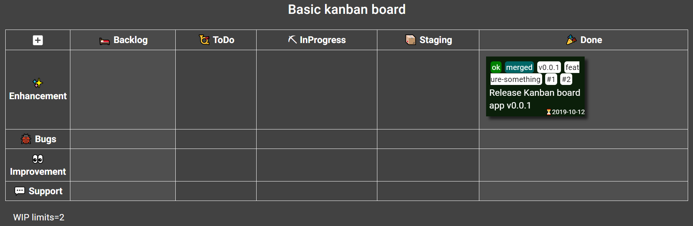
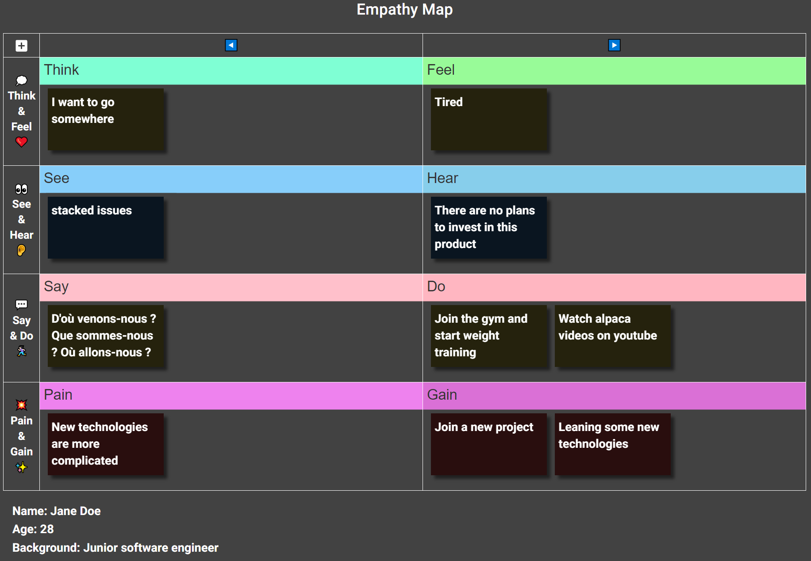
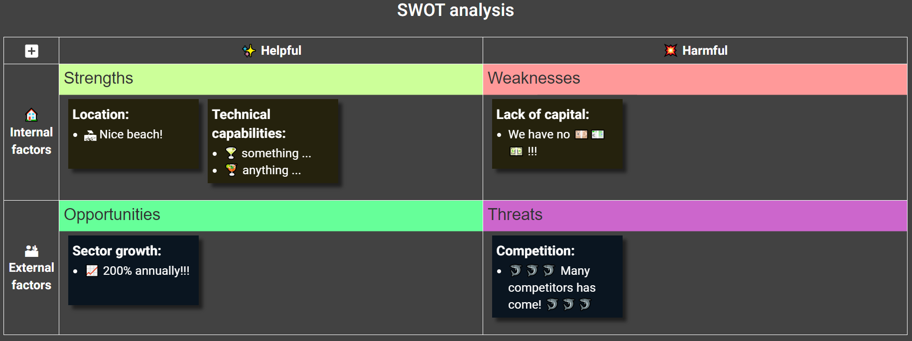
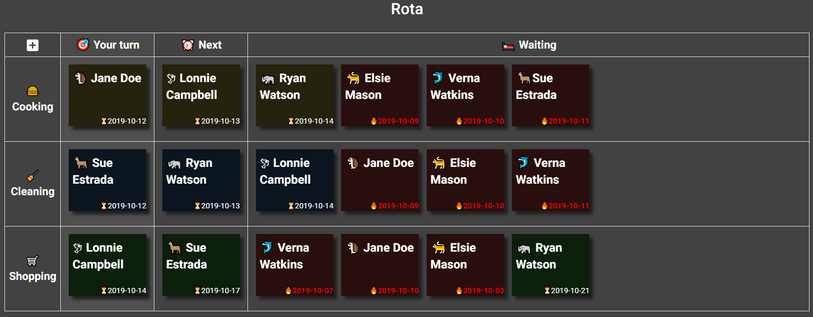
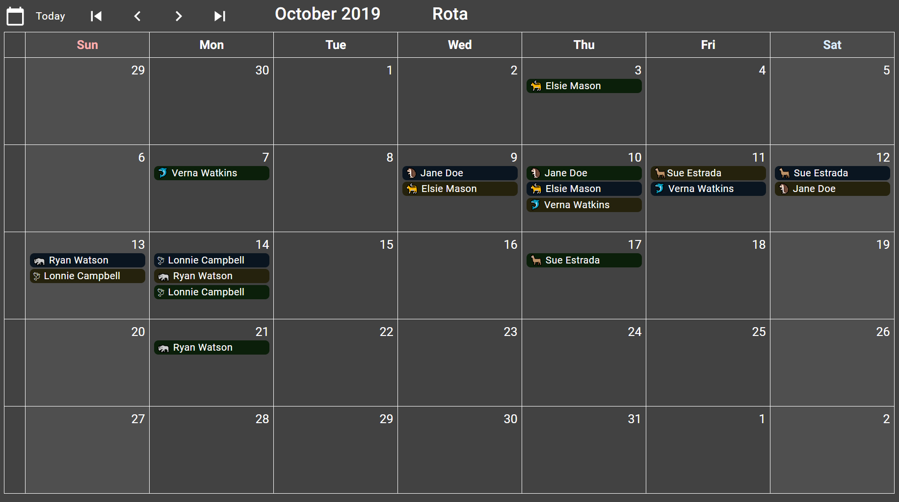

# Board Gallery

### To import the following examples:
1. Click `New board...` to create a board.
1. Open the `Editor` view of the board that created.
1. Paste the configuration text and click the `Save` button.


-----
## Basic Kanban board



<details>
<summary>Click to open board configuration text</summary>

```yaml
name: Basic Kanban board
taskStatuses:
  - value: Backlog
    caption: "\U0001F6CC Backlog"
    className: status-backlog
  - value: ToDo
    caption: "\U0001F4EF ToDo"
    className: status-todo
  - value: InProgress
    caption: ⛏ InProgress
    className: status-inprogress
  - value: Staging
    caption: "\U0001F4E6 Staging"
    className: status-staging
  - value: Done
    caption: "\U0001F389 Done"
    className: status-done
    completed: true
teamOrStories:
  - value: Team A
    caption: ✨ Enhancement
    className: team-or-story-team-a
  - value: Team B
    caption: "\U0001F41E Bugs"
    className: team-or-story-team-b
  - value: Team C
    caption: "\U0001F440 Improvement"
    className: team-or-story-team-c
  - value: Team D
    caption: "\U0001F4AC Support"
    className: team-or-story-team-d
tags:
  - value: bug
    className: tag-bug
  - value: ok
    className: tag-ok
  - value: NG
    className: tag-NG
  - value: PR
    className: tag-PR
  - value: rejected
    className: tag-rejected
  - value: pending
    className: tag-pending
  - value: merged
    className: tag-merged
  - value: critical
    className: tag-critical
  - value: high
    className: tag-high
  - value: moderate
    className: tag-moderate
  - value: low
    className: tag-low
  - value: ⭐
    className: tag-star
  - value: ⭐⭐
    className: tag-star
  - value: ⭐⭐⭐
    className: tag-star
displayBarcode: true
displayMemo: true
displayFlags: true
displayTags: true
preferArchive: false
boardStyle: |
  /* per-board customized styles */
  /*
  .KanbanBoardView-sticky-note {width: 200px}
  .KanbanBoardView-header-cell-task-statuses {min-width: 210px}
  table.KanbanBoardView-board tbody th {
      padding: 10px;
      white-space: nowrap;
  }
  */
  table.KanbanBoardView-board thead th.status-backlog {
      background-color: var(--weak-header-bg-color);
  }
  table.KanbanBoardView-board td.status-backlog {
      background-color: var(--weak-data-bg-color);
  }
  table.KanbanBoardView-board thead th.status-done {
      background-color: var(--weak-header-bg-color);
  }
  table.KanbanBoardView-board td.status-done {
      background-color: var(--weak-data-bg-color);
  }
  .team-or-story-team-b .KanbanBoardView-sticky-note {
      background-color: var(--sticky-blue-color);
  }
  .status-done .KanbanBoardView-sticky-note {
      background-color: var(--sticky-green-color);
  }
  .KanbanBoardView-sticky-tags .tag-bug {
      color: white;
      background-color: red;
  }
  .KanbanBoardView-sticky-tags .tag-ok {
      color: white;
      background-color: green;
  }
  .KanbanBoardView-sticky-tags .tag-NG {
      color: white;
      background-color: #e91e63;
  }
  .KanbanBoardView-sticky-tags .tag-PR {
      color: white;
      background-color: purple;
  }
  .KanbanBoardView-sticky-tags .tag-rejected {
      color: white;
      background-color: #990000;
  }
  .KanbanBoardView-sticky-tags .tag-pending {
      color: black;
      background-color: #ff9900;
  }
  .KanbanBoardView-sticky-tags .tag-merged {
      color: white;
      background-color: #006666;
  }
  .KanbanBoardView-sticky-tags .tag-critical {
      color: white;
      background-color: red;
  }
  .KanbanBoardView-sticky-tags .tag-high {
      color: white;
      background-color: #ff5522;
  }
  .KanbanBoardView-sticky-tags .tag-moderate {
      color: black;
      background-color: #ffcc00;
  }
  .KanbanBoardView-sticky-tags .tag-low {
      color: black;
      background-color: #cc9900;
  }
  .KanbanBoardView-sticky-tags .tag-star {
      color: inherit;
      background-color: inherit;
  }
calendarStyle: |
  /* per-board customized styles */
  div.CalendarView-item-chip.status-done {
      background-color: var(--sticky-green-color);
  }
boardNote: '# WIP limits=2'
records:
  - _id: 222713cd-8be7-475a-a2b6-2a62bca046c6
    dueDate: '2019-10-12'
    taskStatus: Done
    teamOrStory: Team A
    flags: []
    tags:
      - ok
      - merged
      - v0.0.1
      - feature-something
      - '#1'
      - '#2'
    description: Release Kanban board app v0.0.1
    barcode: ''
    memo: ''
```

</details>

-----

## Empathy Map



<details>
<summary>Click to open board configuration text</summary>

```yaml
name: Empathy Map
taskStatuses:
  - value: ToDo
    caption: ◀️
    className: status-todo
  - value: InProgress
    caption: ▶️
    className: status-inprogress
teamOrStories:
  - value: Team A
    caption: "\U0001F4AD Think & Feel ❤️"
    className: team-or-story-team-a
  - value: Team B
    caption: "\U0001F440 See & Hear \U0001F442"
    className: team-or-story-team-b
  - value: Team C
    caption: "\U0001F4AC Say & Do \U0001F3C3\U0001F3FB‍♀️"
    className: team-or-story-team-c
  - value: Team D
    caption: "\U0001F4A5 Pain & Gain ✨"
    className: team-or-story-team-d
tags:
  - value: bug
    className: tag-bug
  - value: ok
    className: tag-ok
  - value: NG
    className: tag-NG
  - value: PR
    className: tag-PR
  - value: rejected
    className: tag-rejected
  - value: pending
    className: tag-pending
  - value: merged
    className: tag-merged
  - value: critical
    className: tag-critical
  - value: high
    className: tag-high
  - value: moderate
    className: tag-moderate
  - value: low
    className: tag-low
  - value: ⭐
    className: tag-star
  - value: ⭐⭐
    className: tag-star
  - value: ⭐⭐⭐
    className: tag-star
displayBarcode: true
displayMemo: true
displayFlags: true
displayTags: true
preferArchive: false
boardStyle: |
  /* per-board customized styles */
  /*
  .KanbanBoardView-sticky-note {width: 200px}
  table.KanbanBoardView-board tbody th {
      padding: 10px;
      white-space: nowrap;
  }
  */
  .KanbanBoardView-header-cell-task-statuses {width: 50%}
  table.KanbanBoardView-board thead th.status-backlog {
      background-color: var(--weak-header-bg-color);
  }
  table.KanbanBoardView-board td.status-backlog {
      background-color: var(--weak-data-bg-color);
  }
  table.KanbanBoardView-board thead th.status-done {
      background-color: var(--weak-header-bg-color);
  }
  table.KanbanBoardView-board td.status-done {
      background-color: var(--weak-data-bg-color);
  }
  .team-or-story-team-b .KanbanBoardView-sticky-note {
      background-color: var(--sticky-blue-color);
  }
  .team-or-story-team-d .KanbanBoardView-sticky-note {
      background-color: var(--sticky-red-color);
  }
  .status-done .KanbanBoardView-sticky-note {
      background-color: var(--sticky-green-color);
  }
  table.KanbanBoardView-board td.status-todo.team-or-story-team-a {
      padding-top: 35px;
      background: url('data:image/svg+xml;charset=UTF-8,<svg xmlns="http://www.w3.org/2000/svg" version="1.1" viewBox="0 0 4850 35"><rect x="0" y="0" width="4850" height="35" fill="aquamarine"/><text font-size="14pt" x="5" y="5" font-family="sans-serif" dominant-baseline="text-before-edge" fill="rgb(51,51,51)">Think</text></svg>') no-repeat left top;
      background-size: 4850px 35px;
      height: 140px;
  }
  table.KanbanBoardView-board td.status-inprogress.team-or-story-team-a {
      padding-top: 35px;
      background: url('data:image/svg+xml;charset=UTF-8,<svg xmlns="http://www.w3.org/2000/svg" version="1.1" viewBox="0 0 4850 35"><rect x="0" y="0" width="4850" height="35" fill="palegreen"/><text font-size="14pt" x="5" y="5" font-family="sans-serif" dominant-baseline="text-before-edge" fill="rgb(51,51,51)">Feel</text></svg>') no-repeat left top;
      background-size: 4850px 35px;
      height: 140px;
  }
  table.KanbanBoardView-board td.status-todo.team-or-story-team-b {
      padding-top: 35px;
      background: url('data:image/svg+xml;charset=UTF-8,<svg xmlns="http://www.w3.org/2000/svg" version="1.1" viewBox="0 0 4850 35"><rect x="0" y="0" width="4850" height="35" fill="lightskyblue"/><text font-size="14pt" x="5" y="5" font-family="sans-serif" dominant-baseline="text-before-edge" fill="rgb(51,51,51)">See</text></svg>') no-repeat left top;
      background-size: 4850px 35px;
      height: 140px;
  }
  table.KanbanBoardView-board td.status-inprogress.team-or-story-team-b {
      padding-top: 35px;
      background: url('data:image/svg+xml;charset=UTF-8,<svg xmlns="http://www.w3.org/2000/svg" version="1.1" viewBox="0 0 4850 35"><rect x="0" y="0" width="4850" height="35" fill="skyblue"/><text font-size="14pt" x="5" y="5" font-family="sans-serif" dominant-baseline="text-before-edge" fill="rgb(51,51,51)">Hear</text></svg>') no-repeat left top;
      background-size: 4850px 35px;
      height: 140px;
  }
  table.KanbanBoardView-board td.status-todo.team-or-story-team-c {
      padding-top: 35px;
      background: url('data:image/svg+xml;charset=UTF-8,<svg xmlns="http://www.w3.org/2000/svg" version="1.1" viewBox="0 0 4850 35"><rect x="0" y="0" width="4850" height="35" fill="pink"/><text font-size="14pt" x="5" y="5" font-family="sans-serif" dominant-baseline="text-before-edge" fill="rgb(51,51,51)">Say</text></svg>') no-repeat left top;
      background-size: 4850px 35px;
      height: 140px;
  }
  table.KanbanBoardView-board td.status-inprogress.team-or-story-team-c {
      padding-top: 35px;
      background: url('data:image/svg+xml;charset=UTF-8,<svg xmlns="http://www.w3.org/2000/svg" version="1.1" viewBox="0 0 4850 35"><rect x="0" y="0" width="4850" height="35" fill="lightpink"/><text font-size="14pt" x="5" y="5" font-family="sans-serif" dominant-baseline="text-before-edge" fill="rgb(51,51,51)">Do</text></svg>') no-repeat left top;
      background-size: 4850px 35px;
      height: 140px;
  }
  table.KanbanBoardView-board td.status-todo.team-or-story-team-d {
      padding-top: 35px;
      background: url('data:image/svg+xml;charset=UTF-8,<svg xmlns="http://www.w3.org/2000/svg" version="1.1" viewBox="0 0 4850 35"><rect x="0" y="0" width="4850" height="35" fill="violet"/><text font-size="14pt" x="5" y="5" font-family="sans-serif" dominant-baseline="text-before-edge" fill="rgb(51,51,51)">Pain</text></svg>') no-repeat left top;
      background-size: 4850px 35px;
      height: 140px;
  }
  table.KanbanBoardView-board td.status-inprogress.team-or-story-team-d {
      padding-top: 35px;
      background: url('data:image/svg+xml;charset=UTF-8,<svg xmlns="http://www.w3.org/2000/svg" version="1.1" viewBox="0 0 4850 35"><rect x="0" y="0" width="4850" height="35" fill="orchid"/><text font-size="14pt" x="5" y="5" font-family="sans-serif" dominant-baseline="text-before-edge" fill="rgb(51,51,51)">Gain</text></svg>') no-repeat left top;
      background-size: 4850px 35px;
      height: 140px;
  }
  .KanbanBoardView-sticky-tags .tag-bug {
      color: white;
      background-color: red;
  }
  .KanbanBoardView-sticky-tags .tag-ok {
      color: white;
      background-color: green;
  }
  .KanbanBoardView-sticky-tags .tag-NG {
      color: white;
      background-color: #e91e63;
  }
  .KanbanBoardView-sticky-tags .tag-PR {
      color: white;
      background-color: purple;
  }
  .KanbanBoardView-sticky-tags .tag-rejected {
      color: white;
      background-color: #990000;
  }
  .KanbanBoardView-sticky-tags .tag-pending {
      color: black;
      background-color: #ff9900;
  }
  .KanbanBoardView-sticky-tags .tag-merged {
      color: white;
      background-color: #006666;
  }
  .KanbanBoardView-sticky-tags .tag-critical {
      color: white;
      background-color: red;
  }
  .KanbanBoardView-sticky-tags .tag-high {
      color: white;
      background-color: #ff5522;
  }
  .KanbanBoardView-sticky-tags .tag-moderate {
      color: black;
      background-color: #ffcc00;
  }
  .KanbanBoardView-sticky-tags .tag-low {
      color: black;
      background-color: #cc9900;
  }
  .KanbanBoardView-sticky-tags .tag-star {
      color: inherit;
      background-color: inherit;
  }
calendarStyle: |
  /* per-board customized styles */
  div.CalendarView-item-chip.status-done {
      background-color: var(--sticky-green-color);
  }
boardNote: |
  # Name: Jane Doe
  # Age: 28
  # Background: Junior software engineer
records:
  - _id: 10d73e46-dd06-494f-9af7-aead593622e9
    dueDate: ''
    taskStatus: ToDo
    teamOrStory: Team C
    flags: []
    tags: []
    description: '# D''où venons-nous ? Que sommes-nous ? Où allons-nous ?'
    barcode: ''
    memo: ''
  - _id: 14883fb7-48bc-4735-a517-76f6eeff1ea6
    dueDate: ''
    taskStatus: InProgress
    teamOrStory: Team D
    flags: []
    tags: []
    description: '# Join a new project'
    barcode: ''
    memo: ''
  - _id: 28f0f4f7-8cef-4e99-82ca-22ba30246c10
    dueDate: ''
    taskStatus: InProgress
    teamOrStory: Team C
    flags: []
    tags: []
    description: '# Join the gym and start weight training'
    barcode: ''
    memo: ''
  - _id: 5c86e1a2-f06e-46e5-8bb1-8c45bea1a5a4
    dueDate: ''
    taskStatus: InProgress
    teamOrStory: Team B
    flags: []
    tags: []
    description: '# There are no plans to invest in this product'
    barcode: ''
    memo: ''
  - _id: 79e4b02f-f389-4b7b-a4a0-4672772ef932
    dueDate: ''
    taskStatus: ToDo
    teamOrStory: Team A
    flags: []
    tags: []
    description: '# I want to go somewhere'
    barcode: ''
    memo: ''
  - _id: 8f8ec928-bc35-4488-8473-bc7f118c4db4
    dueDate: ''
    taskStatus: InProgress
    teamOrStory: Team A
    flags: []
    tags: []
    description: '# Tired'
    barcode: ''
    memo: ''
  - _id: b7ab0301-455b-4e55-a356-0079c4ae0c54
    dueDate: ''
    taskStatus: ToDo
    teamOrStory: Team D
    flags: []
    tags: []
    description: '# New technologies are more complicated'
    barcode: ''
    memo: ''
  - _id: bec582aa-0aad-42e2-ab18-1a2aec0cd4ed
    dueDate: ''
    taskStatus: InProgress
    teamOrStory: Team D
    flags: []
    tags: []
    description: '# Leaning some new technologies'
    barcode: ''
    memo: ''
  - _id: e7b09d85-b5c3-40ed-9f1b-516e667e2eeb
    dueDate: ''
    taskStatus: InProgress
    teamOrStory: Team C
    flags: []
    tags: []
    description: '# Watch alpaca videos on youtube'
    barcode: ''
    memo: ''
  - _id: fd61e926-2738-4401-8219-413872d1962d
    dueDate: ''
    taskStatus: ToDo
    teamOrStory: Team B
    flags: []
    tags: []
    description: '# stacked issues'
    barcode: ''
    memo: ''
```

</details>

-----

## Business Model Canvas


<details>
<summary>Click to open board configuration text</summary>

```yaml
name: Business Model Canvas
taskStatuses:
  - value: ToDo
    caption: ◀️
    className: status-todo
  - value: InProgress
    caption: ▶️
    className: status-inprogress
teamOrStories:
  - value: Team A
    caption: "\U0001F517 Key Partners"
    className: team-or-story-team-a
  - value: Team B
    caption: "✔️ Key Activities & Resources \U0001F3ED"
    className: team-or-story-team-b
  - value: Team C
    caption: "\U0001F381 Value Propositions"
    className: team-or-story-team-c
  - value: Team D
    caption: "❤️ Customer Relationship & Channels \U0001F4E2"
    className: team-or-story-team-d
  - value: Team E
    caption: "\U0001F6BB Customer Segments"
    className: team-or-story-team-e
  - value: Team F
    caption: "\U0001F3F7 Cost Structure & Revenue Streams \U0001F4B0"
    className: team-or-story-team-f
tags:
  - value: bug
    className: tag-bug
  - value: ok
    className: tag-ok
  - value: NG
    className: tag-NG
  - value: PR
    className: tag-PR
  - value: rejected
    className: tag-rejected
  - value: pending
    className: tag-pending
  - value: merged
    className: tag-merged
  - value: critical
    className: tag-critical
  - value: high
    className: tag-high
  - value: moderate
    className: tag-moderate
  - value: low
    className: tag-low
  - value: ⭐
    className: tag-star
  - value: ⭐⭐
    className: tag-star
  - value: ⭐⭐⭐
    className: tag-star
displayBarcode: true
displayMemo: true
displayFlags: true
displayTags: true
preferArchive: false
boardStyle: |
  /* per-board customized styles */
  /*
  .KanbanBoardView-sticky-note {width: 200px}
  table.KanbanBoardView-board tbody th {
      padding: 10px;
      white-space: nowrap;
  }
  */
  .KanbanBoardView-header-cell-task-statuses {width: 50%}
  table.KanbanBoardView-board thead th.status-backlog {
      background-color: var(--weak-header-bg-color);
  }
  table.KanbanBoardView-board td.status-backlog {
      background-color: var(--weak-data-bg-color);
  }
  table.KanbanBoardView-board thead th.status-done {
      background-color: var(--weak-header-bg-color);
  }
  table.KanbanBoardView-board td.status-done {
      background-color: var(--weak-data-bg-color);
  }
  .team-or-story-team-c .KanbanBoardView-sticky-note {
      background-color: var(--sticky-green-color);
  }
  .team-or-story-team-d .KanbanBoardView-sticky-note {
      background-color: var(--sticky-blue-color);
  }
  .team-or-story-team-e .KanbanBoardView-sticky-note {
      background-color: var(--sticky-blue-color);
  }
  .team-or-story-team-f .KanbanBoardView-sticky-note {
      background-color: var(--sticky-red-color);
  }
  table.KanbanBoardView-board td.status-todo.team-or-story-team-a {
      padding-top: 35px;
      background: url('data:image/svg+xml;charset=UTF-8,<svg xmlns="http://www.w3.org/2000/svg" version="1.1" viewBox="0 0 4850 35"><rect x="0" y="0" width="4850" height="35" fill="palegreen"/><text font-size="14pt" x="5" y="5" font-family="sans-serif" dominant-baseline="text-before-edge" fill="rgb(51,51,51)">Key Partners</text></svg>') no-repeat left top;
      background-size: 4850px 35px;
      height: 140px;
  }
  table.KanbanBoardView-board td.status-todo.team-or-story-team-b {
      padding-top: 35px;
      background: url('data:image/svg+xml;charset=UTF-8,<svg xmlns="http://www.w3.org/2000/svg" version="1.1" viewBox="0 0 4850 35"><rect x="0" y="0" width="4850" height="35" fill="aquamarine"/><text font-size="14pt" x="5" y="5" font-family="sans-serif" dominant-baseline="text-before-edge" fill="rgb(51,51,51)">Key Activities</text></svg>') no-repeat left top;
      background-size: 4850px 35px;
      height: 140px;
  }
  table.KanbanBoardView-board td.status-inprogress.team-or-story-team-b {
      padding-top: 35px;
      background: url('data:image/svg+xml;charset=UTF-8,<svg xmlns="http://www.w3.org/2000/svg" version="1.1" viewBox="0 0 4850 35"><rect x="0" y="0" width="4850" height="35" fill="lightgreen"/><text font-size="14pt" x="5" y="5" font-family="sans-serif" dominant-baseline="text-before-edge" fill="rgb(51,51,51)">Key Resources</text></svg>') no-repeat left top;
      background-size: 4850px 35px;
      height: 140px;
  }
  table.KanbanBoardView-board td.status-todo.team-or-story-team-c {
      padding-top: 35px;
      background: url('data:image/svg+xml;charset=UTF-8,<svg xmlns="http://www.w3.org/2000/svg" version="1.1" viewBox="0 0 4850 35"><rect x="0" y="0" width="4850" height="35" fill="skyblue"/><text font-size="14pt" x="5" y="5" font-family="sans-serif" dominant-baseline="text-before-edge" fill="rgb(51,51,51)">Value Propositions</text></svg>') no-repeat left top;
      background-size: 4850px 35px;
      height: 140px;
  }
  table.KanbanBoardView-board td.status-todo.team-or-story-team-d {
      padding-top: 35px;
      background: url('data:image/svg+xml;charset=UTF-8,<svg xmlns="http://www.w3.org/2000/svg" version="1.1" viewBox="0 0 4850 35"><rect x="0" y="0" width="4850" height="35" fill="pink"/><text font-size="14pt" x="5" y="5" font-family="sans-serif" dominant-baseline="text-before-edge" fill="rgb(51,51,51)">Customer Relationship</text></svg>') no-repeat left top;
      background-size: 4850px 35px;
      height: 140px;
  }
  table.KanbanBoardView-board td.status-inprogress.team-or-story-team-d {
      padding-top: 35px;
      background: url('data:image/svg+xml;charset=UTF-8,<svg xmlns="http://www.w3.org/2000/svg" version="1.1" viewBox="0 0 4850 35"><rect x="0" y="0" width="4850" height="35" fill="lightpink"/><text font-size="14pt" x="5" y="5" font-family="sans-serif" dominant-baseline="text-before-edge" fill="rgb(51,51,51)">Channels</text></svg>') no-repeat left top;
      background-size: 4850px 35px;
      height: 140px;
  }
  table.KanbanBoardView-board td.status-todo.team-or-story-team-e {
      padding-top: 35px;
      background: url('data:image/svg+xml;charset=UTF-8,<svg xmlns="http://www.w3.org/2000/svg" version="1.1" viewBox="0 0 4850 35"><rect x="0" y="0" width="4850" height="35" fill="mistyrose"/><text font-size="14pt" x="5" y="5" font-family="sans-serif" dominant-baseline="text-before-edge" fill="rgb(51,51,51)">Customer Segments</text></svg>') no-repeat left top;
      background-size: 4850px 35px;
      height: 140px;
  }
  table.KanbanBoardView-board td.status-todo.team-or-story-team-f {
      padding-top: 35px;
      background: url('data:image/svg+xml;charset=UTF-8,<svg xmlns="http://www.w3.org/2000/svg" version="1.1" viewBox="0 0 4850 35"><rect x="0" y="0" width="4850" height="35" fill="violet"/><text font-size="14pt" x="5" y="5" font-family="sans-serif" dominant-baseline="text-before-edge" fill="rgb(51,51,51)">Cost Structure</text></svg>') no-repeat left top;
      background-size: 4850px 35px;
      height: 140px;
  }
  table.KanbanBoardView-board td.status-inprogress.team-or-story-team-f {
      padding-top: 35px;
      background: url('data:image/svg+xml;charset=UTF-8,<svg xmlns="http://www.w3.org/2000/svg" version="1.1" viewBox="0 0 4850 35"><rect x="0" y="0" width="4850" height="35" fill="tomato"/><text font-size="14pt" x="5" y="5" font-family="sans-serif" dominant-baseline="text-before-edge" fill="rgb(51,51,51)">Revenue Streams</text></svg>') no-repeat left top;
      background-size: 4850px 35px;
      height: 140px;
  }
  .KanbanBoardView-sticky-tags .tag-bug {
      color: white;
      background-color: red;
  }
  .KanbanBoardView-sticky-tags .tag-ok {
      color: white;
      background-color: green;
  }
  .KanbanBoardView-sticky-tags .tag-NG {
      color: white;
      background-color: #e91e63;
  }
  .KanbanBoardView-sticky-tags .tag-PR {
      color: white;
      background-color: purple;
  }
  .KanbanBoardView-sticky-tags .tag-rejected {
      color: white;
      background-color: #990000;
  }
  .KanbanBoardView-sticky-tags .tag-pending {
      color: black;
      background-color: #ff9900;
  }
  .KanbanBoardView-sticky-tags .tag-merged {
      color: white;
      background-color: #006666;
  }
  .KanbanBoardView-sticky-tags .tag-critical {
      color: white;
      background-color: red;
  }
  .KanbanBoardView-sticky-tags .tag-high {
      color: white;
      background-color: #ff5522;
  }
  .KanbanBoardView-sticky-tags .tag-moderate {
      color: black;
      background-color: #ffcc00;
  }
  .KanbanBoardView-sticky-tags .tag-low {
      color: black;
      background-color: #cc9900;
  }
  .KanbanBoardView-sticky-tags .tag-star {
      color: inherit;
      background-color: inherit;
  }
calendarStyle: |
  /* per-board customized styles */
  div.CalendarView-item-chip.status-done {
      background-color: var(--sticky-green-color);
  }
boardNote: ''
records:
  - _id: 0b07ba3c-d487-45fd-ad1b-2ec03f07ea91
    dueDate: ''
    taskStatus: ToDo
    teamOrStory: Team A
    flags: []
    tags: []
    description: '# retail stores'
    barcode: ''
    memo: ''
  - _id: 0d28d625-2489-4441-adf9-33737d187527
    dueDate: ''
    taskStatus: ToDo
    teamOrStory: Team F
    flags: []
    tags: []
    description: '# marketing'
    barcode: ''
    memo: ''
  - _id: 27556868-3dc2-409d-85d5-4f8fb85ec5c4
    dueDate: ''
    taskStatus: ToDo
    teamOrStory: Team B
    flags: []
    tags: []
    description: '# 1 to 1 marketing'
    barcode: ''
    memo: ''
  - _id: 2cf878e9-e1d2-4d89-84d7-17b0c7a015b5
    dueDate: ''
    taskStatus: ToDo
    teamOrStory: Team C
    flags: []
    tags: []
    description: '# sharpness'
    barcode: ''
    memo: ''
  - _id: 379a7d61-3f5e-4f5f-9e87-9dbad29aad79
    dueDate: ''
    taskStatus: ToDo
    teamOrStory: Team D
    flags: []
    tags: []
    description: '# repeating'
    barcode: ''
    memo: ''
  - _id: 559e1bbc-998e-4a9e-aae4-80f6e1b1ad39
    dueDate: ''
    taskStatus: ToDo
    teamOrStory: Team E
    flags: []
    tags: []
    description: |-
      * female
      * age: 25-30
    barcode: ''
    memo: ''
  - _id: 7750b85a-507d-4671-afe2-42fcfcd5715e
    dueDate: ''
    taskStatus: ToDo
    teamOrStory: Team E
    flags: []
    tags: []
    description: |-
      * male
      * age: 20-25
    barcode: ''
    memo: ''
  - _id: 9aefc614-f9b0-4a7d-9802-ce8d058841a7
    dueDate: ''
    taskStatus: InProgress
    teamOrStory: Team F
    flags: []
    tags: []
    description: '# refill purchase'
    barcode: ''
    memo: ''
  - _id: a4b5fd81-009c-492a-9e79-43709755c7c2
    dueDate: ''
    taskStatus: InProgress
    teamOrStory: Team D
    flags: []
    tags: []
    description: '# certified retail stores'
    barcode: ''
    memo: ''
  - _id: d5fb0238-1c89-42fe-8114-9a889a1ecc8f
    dueDate: ''
    taskStatus: ToDo
    teamOrStory: Team B
    flags: []
    tags: []
    description: '# in-store campaign'
    barcode: ''
    memo: ''
  - _id: e45f9c25-7760-47f1-b7b5-11a5c0213100
    dueDate: ''
    taskStatus: InProgress
    teamOrStory: Team B
    flags: []
    tags: []
    description: '# patents'
    barcode: ''
    memo: ''
  - _id: f3312447-4d34-4871-be00-cfd44218a685
    dueDate: ''
    taskStatus: ToDo
    teamOrStory: Team F
    flags: []
    tags: []
    description: '# logistics'
    barcode: ''
    memo: ''
```

</details>

-----

## SWOT analysis



<details>
<summary>Click to open board configuration text</summary>

```yaml
name: SWOT analysis
taskStatuses:
  - value: ToDo
    caption: ✨ Helpful
    className: status-todo
  - value: InProgress
    caption: "\U0001F4A5 Harmful"
    className: status-inprogress
teamOrStories:
  - value: Team A
    caption: "\U0001F3E0 Internal factors"
    className: team-or-story-team-a
  - value: Team B
    caption: "\U0001F3DC External factors"
    className: team-or-story-team-b
tags:
  - value: bug
    className: tag-bug
  - value: ok
    className: tag-ok
  - value: NG
    className: tag-NG
  - value: PR
    className: tag-PR
  - value: rejected
    className: tag-rejected
  - value: pending
    className: tag-pending
  - value: merged
    className: tag-merged
  - value: critical
    className: tag-critical
  - value: high
    className: tag-high
  - value: moderate
    className: tag-moderate
  - value: low
    className: tag-low
  - value: ⭐
    className: tag-star
  - value: ⭐⭐
    className: tag-star
  - value: ⭐⭐⭐
    className: tag-star
displayBarcode: true
displayMemo: true
displayFlags: true
displayTags: true
preferArchive: false
boardStyle: |
  /* per-board customized styles */
  /*
  .KanbanBoardView-sticky-note {width: 200px}
  table.KanbanBoardView-board tbody th {
      padding: 10px;
      white-space: nowrap;
  }
  */
  .KanbanBoardView-header-cell-task-statuses {width: 50%}
  table.KanbanBoardView-board thead th.status-backlog {
      background-color: var(--weak-header-bg-color);
  }
  table.KanbanBoardView-board td.status-backlog {
      background-color: var(--weak-data-bg-color);
  }
  table.KanbanBoardView-board thead th.status-done {
      background-color: var(--weak-header-bg-color);
  }
  table.KanbanBoardView-board td.status-done {
      background-color: var(--weak-data-bg-color);
  }
  .team-or-story-team-b .KanbanBoardView-sticky-note {
      background-color: var(--sticky-blue-color);
  }
  .status-done .KanbanBoardView-sticky-note {
      background-color: var(--sticky-green-color);
  }
  table.KanbanBoardView-board td.status-todo.team-or-story-team-a {
      padding-top: 35px;
      background: url('data:image/svg+xml;charset=UTF-8,<svg xmlns="http://www.w3.org/2000/svg" version="1.1" viewBox="0 0 4850 35"><rect x="0" y="0" width="4850" height="35" fill="rgb(204,255,153)"/><text font-size="14pt" x="5" y="5" font-family="sans-serif" dominant-baseline="text-before-edge" fill="rgb(51,51,51)">Strengths</text></svg>') no-repeat left top;
      background-size: 4850px 35px;
      height: 140px;
  }
  table.KanbanBoardView-board td.status-inprogress.team-or-story-team-a {
      padding-top: 35px;
      background: url('data:image/svg+xml;charset=UTF-8,<svg xmlns="http://www.w3.org/2000/svg" version="1.1" viewBox="0 0 4850 35"><rect x="0" y="0" width="4850" height="35" fill="rgb(255,153,153)"/><text font-size="14pt" x="5" y="5" font-family="sans-serif" dominant-baseline="text-before-edge" fill="rgb(51,51,51)">Weaknesses</text></svg>') no-repeat left top;
      background-size: 4850px 35px;
      height: 140px;
  }
  table.KanbanBoardView-board td.status-todo.team-or-story-team-b {
      padding-top: 35px;
      background: url('data:image/svg+xml;charset=UTF-8,<svg xmlns="http://www.w3.org/2000/svg" version="1.1" viewBox="0 0 4850 35"><rect x="0" y="0" width="4850" height="35" fill="rgb(102,255,153)"/><text font-size="14pt" x="5" y="5" font-family="sans-serif" dominant-baseline="text-before-edge" fill="rgb(51,51,51)">Opportunities</text></svg>') no-repeat left top;
      background-size: 4850px 35px;
      height: 140px;
  }
  table.KanbanBoardView-board td.status-inprogress.team-or-story-team-b {
      padding-top: 35px;
      background: url('data:image/svg+xml;charset=UTF-8,<svg xmlns="http://www.w3.org/2000/svg" version="1.1" viewBox="0 0 4850 35"><rect x="0" y="0" width="4850" height="35" fill="rgb(204,102,204)"/><text font-size="14pt" x="5" y="5" font-family="sans-serif" dominant-baseline="text-before-edge" fill="rgb(51,51,51)">Threats</text></svg>') no-repeat left top;
      background-size: 4850px 35px;
      height: 140px;
  }
  .KanbanBoardView-sticky-tags .tag-bug {
      color: white;
      background-color: red;
  }
  .KanbanBoardView-sticky-tags .tag-ok {
      color: white;
      background-color: green;
  }
  .KanbanBoardView-sticky-tags .tag-NG {
      color: white;
      background-color: #e91e63;
  }
  .KanbanBoardView-sticky-tags .tag-PR {
      color: white;
      background-color: purple;
  }
  .KanbanBoardView-sticky-tags .tag-rejected {
      color: white;
      background-color: #990000;
  }
  .KanbanBoardView-sticky-tags .tag-pending {
      color: black;
      background-color: #ff9900;
  }
  .KanbanBoardView-sticky-tags .tag-merged {
      color: white;
      background-color: #006666;
  }
  .KanbanBoardView-sticky-tags .tag-critical {
      color: white;
      background-color: red;
  }
  .KanbanBoardView-sticky-tags .tag-high {
      color: white;
      background-color: #ff5522;
  }
  .KanbanBoardView-sticky-tags .tag-moderate {
      color: black;
      background-color: #ffcc00;
  }
  .KanbanBoardView-sticky-tags .tag-low {
      color: black;
      background-color: #cc9900;
  }
  .KanbanBoardView-sticky-tags .tag-star {
      color: inherit;
      background-color: inherit;
  }
calendarStyle: |
  /* per-board customized styles */
  div.CalendarView-item-chip.status-done {
      background-color: var(--sticky-green-color);
  }
boardNote: ''
records:
  - _id: 2d112183-e3c2-4c05-a020-116b076dc194
    dueDate: ''
    taskStatus: InProgress
    teamOrStory: Team A
    flags: []
    tags: []
    description: "# Lack of capital:\n* We have no \U0001F4B4\U0001F4B6\U0001F4B5 !!!"
    barcode: ''
    memo: ''
  - _id: 613f8d7f-f606-4b66-b35f-54bd24320c70
    dueDate: ''
    taskStatus: ToDo
    teamOrStory: Team B
    flags: []
    tags: []
    description: "# Sector growth:\n* \U0001F4C8 200% annually!!!"
    barcode: ''
    memo: ''
  - _id: 64abc96d-92f0-4ada-a90e-77d2d1b304b7
    dueDate: ''
    taskStatus: ToDo
    teamOrStory: Team A
    flags: []
    tags: []
    description: "# Location:\n* \U0001F3D6 Nice beach!"
    barcode: ''
    memo: ''
  - _id: 8bf36b77-315f-4593-b86c-7da38b1db74a
    dueDate: ''
    taskStatus: InProgress
    teamOrStory: Team B
    flags: []
    tags: []
    description: "# Competition:\n* \U0001F988\U0001F988\U0001F988 Many competitors has come! \U0001F988\U0001F988\U0001F988"
    barcode: ''
    memo: ''
  - _id: a2a42148-1c11-4ca7-8fdc-650b9ba594cb
    dueDate: ''
    taskStatus: ToDo
    teamOrStory: Team A
    flags: []
    tags: []
    description: "# Technical capabilities:\n* \U0001F378 something ...\n* \U0001F379 anything ..."
    barcode: ''
    memo: ''
```

</details>

-----

## Rota





<details>
<summary>Click to open board configuration text</summary>

```yaml
name: Rota
taskStatuses:
  - value: Staging
    caption: "\U0001F3AF Your turn"
    className: status-staging
  - value: Next
    caption: ⏰ Next
    className: status-next
  - value: ToDo
    caption: "\U0001F6CC Waiting"
    className: status-todo
teamOrStories:
  - value: Team A
    caption: "\U0001F354 Cooking"
    className: team-or-story-team-a
  - value: Team B
    caption: "\U0001F9F9 Cleaning"
    className: team-or-story-team-b
  - value: Team C
    caption: "\U0001F6D2 Shopping"
    className: team-or-story-team-c
tags: []
displayBarcode: true
displayMemo: true
displayFlags: true
displayTags: true
preferArchive: false
boardStyle: |
  /* per-board customized styles */
  .KanbanBoardView-sticky-note {width: 100px}
  .KanbanBoardView-header-cell-task-statuses {min-width: 400px}
  table.KanbanBoardView-board thead th.status-backlog {
      background-color: var(--weak-header-bg-color);
  }
  table.KanbanBoardView-board thead th.status-staging {
      min-width: 120px;
      width: 120px;
      background-color: var(--weak-header-bg-color);
  }
  table.KanbanBoardView-board thead th.status-next {
      min-width: 120px;
      width: 120px;
  }
  table.KanbanBoardView-board td.status-staging {
      background-color: var(--weak-data-bg-color);
  }
  .team-or-story-team-a .KanbanBoardView-sticky-note {
      background-color: var(--sticky-yellow-color);
  }
  .team-or-story-team-b .KanbanBoardView-sticky-note {
      background-color: var(--sticky-blue-color);
  }
  .team-or-story-team-c .KanbanBoardView-sticky-note {
      background-color: var(--sticky-green-color);
  }
  .status-staging .KanbanBoardView-sticky-note {
  }
calendarStyle: |
  /* per-board customized styles */
  div.CalendarView-item-chip.team-or-story-team-a {
      background-color: var(--sticky-yellow-color);
  }
  div.CalendarView-item-chip.team-or-story-team-b {
      background-color: var(--sticky-blue-color);
  }
  div.CalendarView-item-chip.team-or-story-team-c {
      background-color: var(--sticky-green-color);
  }
boardNote: ''
records:
  - _id: 012c6978-577d-45fe-835e-e68823d14451
    dueDate: '2019-10-04'
    taskStatus: ToDo
    teamOrStory: Team B
    flags: []
    tags: []
    description: "# \U0001F54A Lonnie Campbell"
    barcode: ''
    memo: ''
  - _id: 0e95c7d4-e05e-459a-a59a-915daec87fae
    dueDate: '2019-10-04'
    taskStatus: ToDo
    teamOrStory: Team A
    flags: []
    tags: []
    description: "# \U0001F98F Ryan Watson"
    barcode: ''
    memo: ''
  - _id: 2fe60b5f-79ae-4957-ac1b-2dbfbfad8fe0
    dueDate: '2019-10-03'
    taskStatus: ToDo
    teamOrStory: Team B
    flags: []
    tags: []
    description: "# \U0001F994 Jane Doe"
    barcode: ''
    memo: ''
  - _id: 30f646e7-f163-424d-984a-e761e1f5b9bc
    dueDate: '2019-10-07'
    taskStatus: Next
    teamOrStory: Team C
    flags: []
    tags: []
    description: "# \U0001F42C Verna Watkins"
    barcode: ''
    memo: ''
  - _id: 3524d49d-753b-4a0d-8f0f-935d62603711
    dueDate: '2019-10-10'
    taskStatus: ToDo
    teamOrStory: Team C
    flags: []
    tags: []
    description: "# \U0001F994 Jane Doe"
    barcode: ''
    memo: ''
  - _id: 4ec9607f-2f66-48e4-8dc3-f873f5acca11
    dueDate: '2019-10-02'
    taskStatus: Next
    teamOrStory: Team B
    flags: []
    tags: []
    description: "# \U0001F98F Ryan Watson"
    barcode: ''
    memo: ''
  - _id: 50f14e14-6931-43f2-aac3-f74070d8919d
    dueDate: '2019-10-07'
    taskStatus: ToDo
    teamOrStory: Team B
    flags: []
    tags: []
    description: "# \U0001F408 Elsie Mason"
    barcode: ''
    memo: ''
  - _id: 56afd492-3a0e-45e0-bd46-e24e859be80a
    dueDate: '2019-10-03'
    taskStatus: Staging
    teamOrStory: Team C
    flags: []
    tags: []
    description: "# \U0001F408 Elsie Mason"
    barcode: ''
    memo: ''
  - _id: 57a650be-25c6-456c-866b-295f61d79e9a
    dueDate: '2019-10-07'
    taskStatus: ToDo
    teamOrStory: Team A
    flags: []
    tags: []
    description: "# \U0001F408 Elsie Mason"
    barcode: ''
    memo: ''
  - _id: 72197edc-c321-49a5-a76c-bafa3775e205
    dueDate: '2019-10-08'
    taskStatus: ToDo
    teamOrStory: Team A
    flags: []
    tags: []
    description: "# \U0001F42C Verna Watkins"
    barcode: ''
    memo: ''
  - _id: 78c2aa66-414a-483c-8306-0c6e171f088d
    dueDate: '2019-10-02'
    taskStatus: Next
    teamOrStory: Team A
    flags: []
    tags: []
    description: "# \U0001F54A Lonnie Campbell"
    barcode: ''
    memo: ''
  - _id: 8b69aaee-2530-4f84-acf7-eecf4960416d
    dueDate: '2019-10-21'
    taskStatus: ToDo
    teamOrStory: Team C
    flags: []
    tags: []
    description: "# \U0001F98F Ryan Watson"
    barcode: ''
    memo: ''
  - _id: 8ff0d796-aa0d-4a7b-9c91-93add0879007
    dueDate: '2019-10-17'
    taskStatus: ToDo
    teamOrStory: Team C
    flags: []
    tags: []
    description: "# \U0001F999 Sue Estrada"
    barcode: ''
    memo: ''
  - _id: a13d3608-8fef-4a7f-b5dd-a4e63c086b59
    dueDate: '2019-10-14'
    taskStatus: ToDo
    teamOrStory: Team C
    flags: []
    tags: []
    description: "# \U0001F54A Lonnie Campbell"
    barcode: ''
    memo: ''
  - _id: a42f30b4-1495-4bf4-9a25-a9d65eaeb0ec
    dueDate: '2019-10-01'
    taskStatus: Staging
    teamOrStory: Team B
    flags: []
    tags: []
    description: "# \U0001F999 Sue Estrada"
    barcode: ''
    memo: ''
  - _id: a86cb1b5-4855-4f66-86b0-b47e927d3311
    dueDate: '2019-10-03'
    taskStatus: ToDo
    teamOrStory: Team A
    flags: []
    tags: []
    description: "# \U0001F999Sue Estrada"
    barcode: ''
    memo: ''
  - _id: ae576f5f-9d1a-4463-bc3e-de75d493a116
    dueDate: '2019-10-01'
    taskStatus: Staging
    teamOrStory: Team A
    flags: []
    tags: []
    description: "# \U0001F994 Jane Doe"
    barcode: ''
    memo: ''
  - _id: c2d2cd8d-e737-4f64-bc84-3ebaf48fcd84
    dueDate: '2019-10-08'
    taskStatus: ToDo
    teamOrStory: Team B
    flags: []
    tags: []
    description: "# \U0001F42C Verna Watkins"
    barcode: ''
    memo: ''
```

</details>

